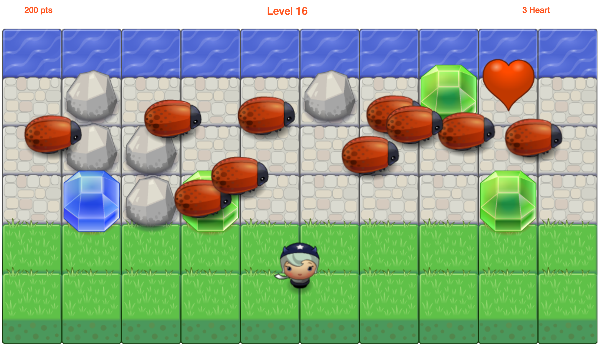

arcade game
===============================

How to run:
---------------
- Download of fork the application
- You can also find it on [here](https://tiechengsu.github.io/frontend-nanodegree-arcade-game/)

How to use:
---------------
In this game you have a Player and Enemies(Bugs). The goal of the player is to reach the water, without colliding into any one of the enemies. Every time the player reach the water, the level will be up by one and you will win the game when you reach level 20. The player can move left, right, up and down.

Characters:
----------------
You will pick you character first.

Enemy:
-----------------
Try to avoid the bug

Gem:
-------------------
You will try to collect Gems in order to get points

-Blue Gem: 300 pts
-Green Gem: 200 pts
-Orange Gem: 100 pts

Heart:
------------------
You will have three lifes at the very beginning, collect the heart to increase your lifes

Rock:
----------------------------
The rock will block your way

Addional rules:
-------------------------
Use space to pause the game

Screenshot
--------------------------

